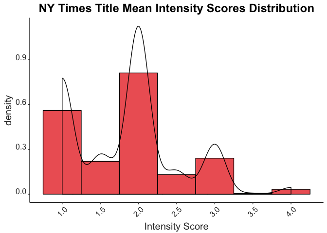
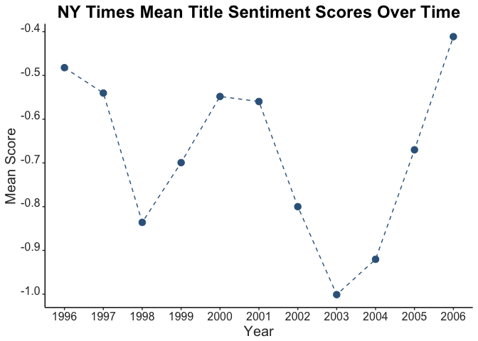
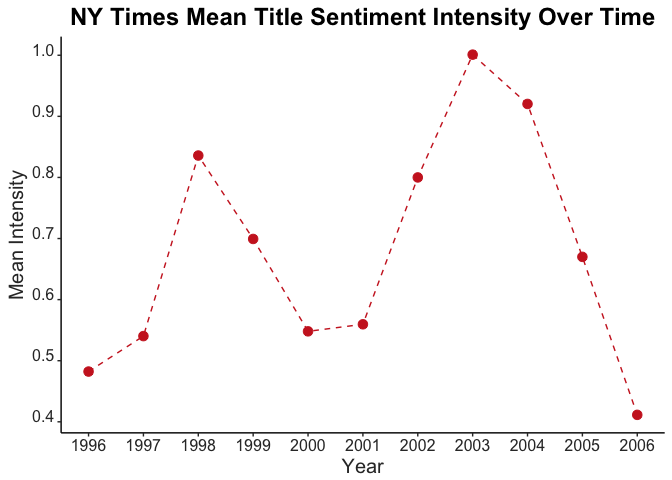

Text Analysis
================

Your mission
============

Perform text analysis.

Okay, I need more information
-----------------------------

Perform sentiment analysis or topic modeling using text analysis methods as demonstrated in the pre-class work and in the readings.

Okay, I need even more information.
-----------------------------------

Do the above. Can't think of a data source?

-   `gutenbergr`
-   `AssociatedPress` from the `topicmodels` package
-   `NYTimes` or `USCongress` from the `RTextTools` package
-   Harry Potter Complete 7 Books text \`\`\` if (packageVersion("devtools") &lt; 1.6) { install.packages("devtools") }

devtools::install\_github("bradleyboehmke/harrypotter") \`\``- [State of the Union speeches](https://pradeepadhokshaja.wordpress.com/2017/03/31/scraping-the-web-for-presdential-inaugural-addresses-using-rvest/) - Scrape tweets using [`twitteR\`\](<https://www.credera.com/blog/business-intelligence/twitter-analytics-using-r-part-1-extract-tweets/>)

Analyze the text for sentiment OR topic. **You do not need to do both**. The datacamp courses and [Tidy Text Mining with R](http://tidytextmining.com/) are good starting points for templates to perform this type of analysis, but feel free to *expand beyond these examples*.

Timelines and Task
==================

We will spend the next 2 weeks working on analyzing textual data in R. You will do the following:

-   Start with some text based data.
-   Clean data and prepare it for analysis
-   Ask questions about the data
-   Answer these questions with the data using tables and graphics
-   Each group member must have their own unique question that they code the answer for.

SET UP
------

``` r
# Get libraries
library(tidytext)
```

    ## Warning: package 'tidytext' was built under R version 3.4.2

``` r
library(dplyr)
```

    ## Warning: package 'dplyr' was built under R version 3.4.1

    ## 
    ## Attaching package: 'dplyr'

    ## The following objects are masked from 'package:stats':
    ## 
    ##     filter, lag

    ## The following objects are masked from 'package:base':
    ## 
    ##     intersect, setdiff, setequal, union

``` r
library(rebus)
library(stringr)
```

    ## 
    ## Attaching package: 'stringr'

    ## The following object is masked from 'package:rebus':
    ## 
    ##     regex

``` r
library(ggplot2)
```

    ## 
    ## Attaching package: 'ggplot2'

    ## The following object is masked from 'package:rebus':
    ## 
    ##     alpha

Prepare Titles and Sentiment Scores
-----------------------------------

``` r
# Get Data
library(RTextTools)
```

    ## Loading required package: SparseM

    ## 
    ## Attaching package: 'SparseM'

    ## The following object is masked from 'package:base':
    ## 
    ##     backsolve

``` r
data(NYTimes)


# Get dictionary with sentiment scores using lexicon afinn 
sentiment.scores = as.data.frame(get_sentiments("afinn"))

# Prepare the titles as strings by converting title to characters
NYTimes$title = (as.character(NYTimes$Title))
```

Sentiments of NY Times Titles
=============================

Intensity of Negative and Positive Words in NY Times Titles
-----------------------------------------------------------

This section looks at what the frequency distribution of the intensity of negative and positive words used in the NY Times titles are.

``` r
# Create a data frame that will contain the sentiment scores for each word in the title
scores = NYTimes %>%
  # group the data by title
  group_by(Title) %>%
  # get each word from the title out by unnesting
  unnest_tokens(output=word, input=title) %>%
  # get the sentiment scores for each word in the title 
  inner_join(sentiment.scores) %>%
  # get a mean of the score for each word in the title to get an average sentiment score for each title 
  summarize(title.score = mean(score))
```

    ## Joining, by = "word"

``` r
# plot mean scores for each title 

ggplot(scores,aes(title.score)) + 
  labs(x = "Mean Score") +
  geom_histogram(color="black",fill="lightblue1",aes(y=..density..), binwidth=1) +
  geom_density() + 
  scale_x_continuous(breaks = pretty(scores$title.score, n = 10)) +
  ggtitle("NY Times Title Mean Sentiment Scores Distribution") +
  theme(plot.title = element_text(color="black", face="bold", size=18,hjust = 0.5)) +
  #theme_bw() + 
  theme(panel.border = element_blank(), panel.grid.major = element_blank(),
        panel.grid.minor = element_blank(), axis.line = element_line(colour = "black")) +
 theme(panel.background = element_rect(fill='white')) +
  theme(axis.text.x = element_text(colour="grey20",size=12,angle=45,hjust=.5,vjust=.5,face="plain"),
        axis.text.y = element_text(colour="grey20",size=12,angle=0,hjust=1,vjust=0,face="plain"),  
        axis.title.x = element_text(colour="grey20",size=15,angle=0,hjust=.5,vjust=0,face="plain"),
        axis.title.y = element_text(colour="grey20",size=15,angle=90,hjust=.5,vjust=.5,face="plain"))
```


This plot shows the frequency of the mean intensities of positive/negative words used in the titles. A higher absolute value indicates greater intensity of an emotion in words for the title, whereas a lower one indicates less intensity. Negative numbers indicate negative emotions whereas positive numbers indicate positive emotions.

Extremeness of Emotional Words Used in NY Times Titles
------------------------------------------------------

This section looks at just how intense the emotions of the words in NY Times titles are (i.e., it doesn't matter whether the emotions are negative or positive; we are just interested in how extreme these emotions get).

``` r
# We do the same thing as Part 1a except now, if the scores are negative, we get the absolute value of them.

# Create a data frame that will contain the sentiment scores for each word in the title
scores = NYTimes %>%
  # group the data by title
  group_by(Title) %>%
  # get each word from the title out by unnesting
  unnest_tokens(output=word, input=title) %>%
  # get the sentiment scores for each word in the title 
  inner_join(sentiment.scores) %>%
  # get the absolute value of the sentiment scores so that we get the intensity score
  mutate(intensity.score = abs(score))
```

    ## Joining, by = "word"

``` r
# get a mean of the intensity for each titles 
scores = scores %>% 
  group_by(Title) %>%
  summarize(title.intensity.score = mean(intensity.score))

# plot mean scores for each title 
ggplot(scores,aes(title.intensity.score)) + 
  # label the x-axis 
  labs(x = "Intensity Score") +
  # create histogram with a density curve
  geom_histogram(color="black",fill="indianred2",aes(y=..density..), binwidth=0.5) +
  geom_density() + 
  # label the x-axis tick marks in a way that's intuitive
  scale_x_continuous(breaks = pretty(scores$title.intensity.score, n = 10)) +
  # make the title nice
  ggtitle("NY Times Title Mean Intensity Scores Distribution") +
  theme(plot.title = element_text(color="black", face="bold", size=18,hjust = 0.5)) +
  # get the background to be white and get rid of the grid marks
  theme(panel.border = element_blank(), panel.grid.major = element_blank(),
        panel.grid.minor = element_blank(), axis.line = element_line(colour = "black")) +
 theme(panel.background = element_rect(fill='white')) +
  # make the axis tick marks and text look nicer 
  theme(axis.text.x = element_text(colour="grey20",size=12,angle=45,hjust=.5,vjust=.5,face="plain"),
        axis.text.y = element_text(colour="grey20",size=12,angle=0,hjust=1,vjust=0,face="plain"),  
        axis.title.x = element_text(colour="grey20",size=15,angle=0,hjust=.5,vjust=0,face="plain"),
        axis.title.y = element_text(colour="grey20",size=15,angle=90,hjust=.5,vjust=.5,face="plain"))
```



How is it different by time?

``` r
############# Get years

#1. Convert Dates to Strings

# make the date as characters
NYTimes$Date = as.character(NYTimes$Date)

# now convert the date to strings
for (i in 1:length(NYTimes$Date)){
NYTimes$Date[i] = toString(NYTimes$Date[i])
}

#2. Extract the Year
# create a pattern for how the year will look like
year_pattern = DGT %R% DGT %R% END
# get the year using this pattern and put this year in our data frame with scores
NYTimes$year = str_extract(NYTimes$Date, pattern=year_pattern)

# now, create a new data frame that will contain the sentiment scores for titles by year

# first, get the mean sentiment scores for each title
scores2 = 
NYTimes %>% 
  group_by(Title, year) %>%
   # get each word from the title out by unnesting
  unnest_tokens(output=word, input=title) %>%
  # get the sentiment scores for each word in the title 
  inner_join(sentiment.scores) %>%
  # mean score
  summarize(title.score = mean(score))
```

    ## Joining, by = "word"

``` r
# now, group by year so that we get a mean sentiment score for each year  
scores2 =
  scores2 %>%
  group_by(year) %>%
  summarize(year.score = mean(title.score))

# create a new data frame to get the absolute value for each year so that we get intensity scores

scores3 = 
  scores2 %>% 
  mutate(year.intensity = abs(year.score))

# change the years to be numeric
scores2$year = (as.numeric(scores2$year))

# change the years to be from year 1 to year 10 by making 1996 as year 1 and 2006 as year 10 
scores2 = scores2 %>% 
  mutate(year.num = ifelse(scores2$year<=6, 10-scores2$year, abs(96-scores2$year)))
scores3$year.num = scores2$year.num

# LINE PLOTS

# This plots the sentiment scores
ggplot(data=scores2, aes(x=year.num,y=year.score)) +
  geom_line(color="steelblue4", linetype="dashed") +
  labs(x = "Year", y = "Mean Score") +
  scale_x_continuous(breaks = pretty(scores2$year.num, n = 10),labels=c(1996:2006)) +
  scale_y_continuous(breaks = pretty(scores2$year.score, n = 8)) +
  geom_point(size=3,color="steelblue4") +
  ggtitle("NY Times Mean Title Sentiment Scores Over Time") +
  theme(plot.title = element_text(color="black", face="bold", size=18,hjust = 0.5)) +
  #theme_bw() + 
  theme(panel.border = element_blank(), panel.grid.major = element_blank(),
        panel.grid.minor = element_blank(), axis.line = element_line(colour = "black")) +
  theme(panel.background = element_rect(fill='white')) +
      theme(axis.text.x = element_text(colour="grey20",size=12,angle=0,hjust=.5,vjust=.5,face="plain"),
        axis.text.y = element_text(colour="grey20",size=12,angle=0,hjust=1,vjust=0,face="plain"),  
        axis.title.x = element_text(colour="grey20",size=15,angle=0,hjust=.5,vjust=0,face="plain"),
        axis.title.y = element_text(colour="grey20",size=15,angle=90,hjust=.5,vjust=.5,face="plain"))
```



``` r
# This plots the intensity scores
ggplot(data=scores3, aes(x=year.num,y=year.intensity)) +
  geom_line(color="firebrick3", linetype="dashed") +
  labs(x = "Year", y = "Mean Intensity") +
  scale_x_continuous(breaks = pretty(scores3$year.num, n = 10),labels=c(1996:2006)) +
  scale_y_continuous(breaks = pretty(scores3$year.intensity, n = 8)) +
  geom_point(size=3,color="firebrick3") +
  ggtitle("NY Times Mean Title Sentiment Intensity Over Time") +
  theme(plot.title = element_text(color="black", face="bold", size=18,hjust = 0.5)) +
  #theme_bw() + 
  theme(panel.border = element_blank(), panel.grid.major = element_blank(),
        panel.grid.minor = element_blank(), axis.line = element_line(colour = "black")) +
  theme(panel.background = element_rect(fill='white')) +
      theme(axis.text.x = element_text(colour="grey20",size=12,angle=0,hjust=.5,vjust=.5,face="plain"),
        axis.text.y = element_text(colour="grey20",size=12,angle=0,hjust=1,vjust=0,face="plain"),  
        axis.title.x = element_text(colour="grey20",size=15,angle=0,hjust=.5,vjust=0,face="plain"),
        axis.title.y = element_text(colour="grey20",size=15,angle=90,hjust=.5,vjust=.5,face="plain"))
```


